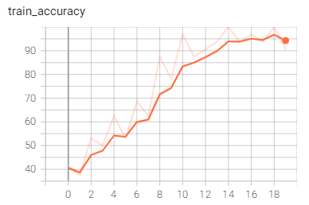
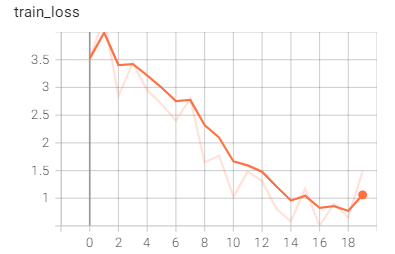
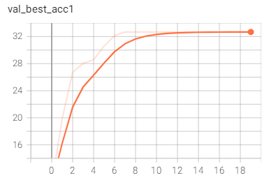
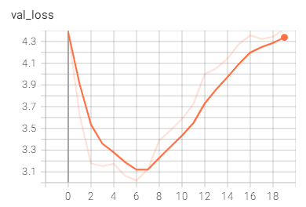
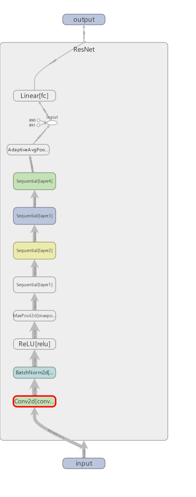
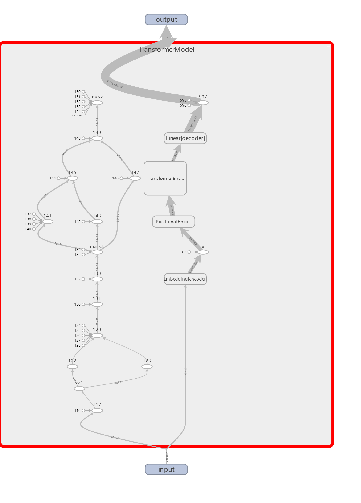

# DL-intro-1

文件说明：

> task1

`change_tag.py`是改动val文件夹排布的脚本；

`HW2.py`是运行脚本，对应的`HW2.diff`为改动文件。

> task2

其余python文件均为task2。

## 任务一：**在** **Tiny-ImageNet** **数据集上训练** **Resnet** 模型

### 调试过程（对应作业要求中的(3)(4)(5)(6)）

- 尝试使用dummy功能初看脚本是否能运行，结果说是在cpu上运行，太过缓慢。
- 加入指令`--gpu 0`，仍然在cpu上运行。经过查询，`torch.cuda.is_available()`显示false，原因是当初下载是用的清华镜像，应该在官网下载对应cuda版本。
- 使用命令`python HW2.py -a resnet18 -b 64 --epochs 15 --gpu 0 C:\Users\Adydio\Desktop\大二下\pythondl\tiny-imagenet-200\tiny-imagenet-200`没有使用tensorboard，训练速度较慢，acc后面到了0.6,0.7左右。
- 配置了tensorboard，先试一下3个epoch，可以在tensorboard里面看到网络的结构（见后）。手动添加代码记录accuracy和loss，图像均有显示。然而training的accuracy最高也在百分之六七十。
- 写脚本`change_tag.py`，参考了bitahub上面的`val_reorg`文件夹的排布形式，将原有的`val`文件夹改成了相对应的形式。再次运行，一开始出现了bug，我猜测原因是文件夹的形式发生了变化，这也是意料之中。因此我有参考了bitahub上反例的`main.py`修改了读取测试集的代码，运行成功。此外，我还删去了对图像进行裁剪的代码，这一次训练速度比之前快了很多，在训练集上的表现非常好，在大约14-15个epoch后在训练集上的accuracy始终维持在95%以上，相对应的，training loss也在逐渐降低。而对于测试集，其acc@5没有突破过60%。最终运行一次，增加了一些tensorboard的graph，并且微调了checkpoint的文件名。validation loss在约7-8个epoch后不减反增，判断为过拟合现象。下图中，train_accuracy是训练的top5精度，val_best_acc1是测试集的top1精度。图中的横轴均为epoch。









- **（比对不同GPU数量的训练时间）** 加入了时间参数，得到的结果如下：

  | GPU数量 | 训练时间(s) | epoch |
  | ------- | ----------- | ----- |
  | CPU     | 1338        | 1     |
  | 单GPU   | 1102        | 20    |
  | 2GPUs   | 1029        | 20    |

我们看到GPU的运行效果是远好于CPU的，然而单纯增多GPU的数量并没有给整体的运行速度带来很大改变。CPU本可以更快，指令`-j`设置大一点可以让CPU训练的更快一些。此外，GPU也不是越多越好，可能是数据加载和预处理的速度成为了训练速度的瓶颈，也可能是GPU 之间的通信和同步操作较为耗时，也有可能是操作有误。

- **（利用--evaluate指令对比两次评估的差异）** 分别进行了两次训练得到了根目录下`checkpoint1.pth`和`checkpoint2.pth`。分别使用指令

```
python HW2.py -a resnet18 --gpu 0  --evaluate --resume checkpointX.pth C:\Users\Adydio\Desktop\大二下\pythondl\tiny-imagenet-200\tiny-imagenet-200
```

$$X=1,2$$运行，得到的输出如下：

```
Test: [ 1/40]   Time 15.294 (15.294)    Loss 3.4441e+00 (3.4441e+00)    Acc@1  34.77 ( 34.77)   Acc@5  63.28 ( 63.28)
Test: [11/40]   Time  0.068 ( 1.422)    Loss 4.2087e+00 (4.0738e+00)    Acc@1  30.86 ( 30.43)   Acc@5  53.52 ( 57.42)
Test: [21/40]   Time  0.020 ( 0.762)    Loss 4.8543e+00 (4.4147e+00)    Acc@1  23.83 ( 27.90)   Acc@5  46.09 ( 52.92)
Test: [31/40]   Time  0.103 ( 0.530)    Loss 4.9377e+00 (4.4528e+00)    Acc@1  23.05 ( 27.85)   Acc@5  46.09 ( 51.93)
 *   Acc@1 28.080 Acc@5 52.670
```

```
Test: [ 1/40]   Time 13.507 (13.507)    Loss 3.4300e+00 (3.4300e+00)    Acc@1  41.41 ( 41.41)   Acc@5  65.23 ( 65.23)
Test: [11/40]   Time  0.017 ( 1.251)    Loss 4.3355e+00 (4.0531e+00)    Acc@1  29.69 ( 32.39)   Acc@5  53.91 ( 58.24)
Test: [21/40]   Time  0.017 ( 0.667)    Loss 4.4721e+00 (4.3151e+00)    Acc@1  32.81 ( 29.93)   Acc@5  50.39 ( 54.69)
Test: [31/40]   Time  0.050 ( 0.461)    Loss 4.8590e+00 (4.4470e+00)    Acc@1  23.05 ( 28.68)   Acc@5  49.61 ( 52.86)
 *   Acc@1 29.690 Acc@5 54.410
```

在原文件的`run_validate`函数中添加代码来寻找预测结果不同的图片。为了找到这些，我们先找到这个图片的顺序。首先我们在输入命令的时候吧batch size设置为1，这样一次预测的就是一张图片。下面看代码：

```python
                output = model(images)
                loss = criterion(output, target)
                model.load_state_dict(checkpoint1['state_dict'])
                output1 = model(images)
                _, predicted_label1 = torch.topk(output1, k=1)
                pred1 = predicted_label1[0].item()
                model.load_state_dict(checkpoint2['state_dict'])
                output2 = model(images)
                _, predicted_label2 = torch.topk(output2, k=1)
                pred2 = predicted_label2[0].item()
                if pred1 != pred2:
                    different_images.append(i)
            print(f"评判结果不同的图片索引: {different_images[:10]}")
            for s in different_images[:10]:
                count = 0
                subfolders = os.listdir(os.path.join(args.data, 'val'))
                for folder in subfolders:
                    folder_path = os.path.join(os.path.join(args.data, 'val'), folder)
                    image_files = sorted(os.listdir(folder_path))
                    num_images = len(image_files)
                    if count + num_images >= s:
                        image_name = image_files[s - count - 1]
                        print(f"第 {s} 张图片：{image_name}")
                        break
                    count += num_images
```

先通过`topk()`函数得到每个图片的预测值，再分别比较，遇到不同的就计入数组中。再根据这些图片对应的顺序（位置）来找到它们的文件名。设置输出10张图片时，对应的（部分）输出如下：

```
评判结果不同的图片索引: [4, 6, 12, 14, 15, 18, 19, 20, 21, 22]
第 4 张图片：val_1551.JPEG
第 6 张图片：val_1917.JPEG
第 12 张图片：val_3419.JPEG
第 14 张图片：val_3545.JPEG
第 15 张图片：val_3609.JPEG
第 18 张图片：val_4385.JPEG
第 19 张图片：val_4558.JPEG
第 20 张图片：val_4653.JPEG
第 21 张图片：val_4890.JPEG
第 22 张图片：val_5085.JPEG
```

### ResNet的结构（对应作业要求中的(1)）

  ResNet-18是一个经典的卷积神经网络架构，包含了多个卷积层、池化层、全连接层和归一化层。从tensorboard生成的描述中，可以总结其各层信息如下：

1. Conv2d: 卷积层
- 输入大小: 3x224x224
- 输出大小: 64x112x112
2. BatchNorm2d:归一化
- 输入大小: 64x112x112
- 输出大小: 64x112x112
3. ReLU:激活函数
- 输入大小: 64x112x112
- 输出大小: 64x112x112
4. MaxPool2d: 最大池化层
- 输入大小: 64x112x112
- 输出大小: 64x56x56 (2 tensors)
5. Sequential Layer1: 
- 输入大小: 64x56x56(2 tensors)
- 输出大小: 64x56x56(2 tensors)
6. Sequential Layer2: 
- 输入大小: 64x56x56(2 tensors)
- 输出大小: 128x28x28(2 tensors)
7. Sequential Layer3: 
- 输入大小: 128x28x28(2 tensors)
- 输出大小: 256x14x14(2 tensors)
8. Sequential Layer4: 
- 输入大小: 256x14x14(2 tensors)
- 输出大小: 512x7x7
9. AvgPool: 平均池化层
- 输入大小: 512x7x7
- 输出大小: 512x1x1
10. Linear FC: 全连接层
- 输入大小: 512
- 输出大小: 200

tensorboard生成的结构图如下：



### 代码改动说明（对应作业要求中的(2)）

在git中输入命令：

```
git diff 832351877971a97b800c0801dac38e303a2f2e84 4ce2e4a184d898d5bceedb8ec6ace5039ce789a6 HW2.py >HW2.diff
```

生成根目录下`HW2.diff`文件，下面分析我的所有改动：

- 引入tensorboard

```
+from torch.utils.tensorboard import SummaryWriter
+    writer.add_graph(model, torch.zeros((1, 3, 224, 224), device=device))
+        writer.add_scalar("val_best_acc1", best_acc1, epoch)
+        writer.add_scalar("val_loss", losses, epoch)
+    writer.add_scalar("train_loss", loss, epoch)
+    writer.add_scalar("train_accuracy", acc5[0], epoch)
+writer = SummaryWriter(log_dir="runs/task1_CPU")
+    writer.close()
```

- 计算运行时长

```
+    start_time = time.time()

+    print("训练时长：{}s".format(time.time()-start_time))
```

- 修改输出维数至200

```
 def main_worker(gpu, ngpus_per_node, args):
@@ -143,7 +150,10 @@ def main_worker(gpu, ngpus_per_node, args):
     else:
         print("=> creating model '{}'".format(args.arch))
         model = models.__dict__[args.arch]()
-
+    fc = model.fc
+    in_features = fc.in_features
+    new_fc = torch.nn.Linear(in_features, 200)
+    model.fc = new_fc
```

- 删去裁剪代码，提高运行速度

```
-                transforms.RandomResizedCrop(224),
-                transforms.RandomHorizontalFlip(),

-                transforms.Resize(256),
-                transforms.CenterCrop(224),
```

- 获取每个epoch的loss便于用tensorboard作图

```
-        acc1 = validate(val_loader, model, criterion, args)
+        acc1, losses = validate(val_loader, model, criterion, args)
```

注意下面validate函数的返回值多了一个loss。

- 修改validate函数

```
@@ -401,10 +431,10 @@ def validate(val_loader, model, criterion, args):
 
     progress.display_summary()
 
-    return top1.avg
+    return top1.avg, losses.avg
```

还有零星的删改，参考了bitahub上面范例，如果不做一些小的改动仍然会报错。所有的修改可以在`HW2.diff`里查看。输出十张判断不同的图片代码之前讲过了这里就不赘述。

## 任务二：复现Word-level Language Model并讨论

### (1)复现

利用指令`python main.py --cuda --epochs 6 --model Transformer --lr 5`训练模型，最后几行的输出如下：

```
| epoch   6 |  2600/ 2983 batches | lr 5.00 | ms/batch 13.81 | loss  4.87 | ppl   130.35
| epoch   6 |  2800/ 2983 batches | lr 5.00 | ms/batch 13.94 | loss  4.81 | ppl   123.03
-----------------------------------------------------------------------------------------
| end of epoch   6 | time: 45.16s | valid loss  5.36 | valid ppl   212.05
-----------------------------------------------------------------------------------------
=========================================================================================
| End of training | test loss  5.26 | test ppl   192.94
=========================================================================================
```

在利用`python generate.py --cuda`指令生成文本，刚开始遇到报错：

```
UnicodeEncodeError: 'gbk' codec can't encode character '\xeb' in position 2: illegal multibyte sequence
```

在原代码第66行写入文件的代码中加入`encoding='utf-8'`成功解决问题。生成的文本在`generated.txt`中。最后几行输出如下：

```
| Generated 700/1000 words
| Generated 800/1000 words
| Generated 900/1000 words
```

具体实验截图见“实验截图”文件夹。

### (2)可视化Transformer结构

用tensorboard尝试数小时后失败，首先尝试手动打印Transformer的结构：

```
TransformerModel(
  (pos_encoder): PositionalEncoding(
    (dropout): Dropout(p=0.2, inplace=False)
  )
  (Transformer_encoder): TransformerEncoder(
    (layers): ModuleList(
      (0-1): 2 x TransformerEncoderLayer(
        (self_attn): MultiheadAttention(
          (out_proj): NonDynamicallyQuantizableLinear(in_features=200, out_features=200, bias=True)
        )
        (linear1): Linear(in_features=200, out_features=200, bias=True)
        (dropout): Dropout(p=0.2, inplace=False)
        (linear2): Linear(in_features=200, out_features=200, bias=True)
        (norm1): LayerNorm((200,), eps=1e-05, elementwise_affine=True)
        (norm2): LayerNorm((200,), eps=1e-05, elementwise_affine=True)
        (dropout1): Dropout(p=0.2, inplace=False)
        (dropout2): Dropout(p=0.2, inplace=False)
      )
    )
  )
  (encoder): Embedding(33278, 200)
  (decoder): Linear(in_features=200, out_features=33278, bias=True)
)
```

在此之后由于没有直接手段获取输入的维数，索性直接使用代码中的data来作为dummydata。但是遇到离奇报错，最终修改了`models.py`中142-143行部分参数解决问题。得到的图如下：



相比在网上或者视频上看到的Transformer模型，这个模型应该是得到了简化的。

### (3)阅读论文和总结

>  Attention is All You Need

我觉得这篇论文提出的 Transformer 模型在捕捉上下文依赖方面与传统的卷积神经网络 (CNN) 有明显的差异。传统的卷积神经网络主要利用卷积操作来提取局部特征和捕捉局部依赖关系。通过滑动窗口的方式，卷积神经网络将输入信号的局部信息与卷积核进行卷积操作，从而生成具有空间局部性的特征图。这种局部连接和共享权重的设计使得卷积神经网络在处理图像等具有局部结构的数据时表现出色。然而，对于长距离的依赖关系，传统的卷积操作受限于固定大小的局部感受野，可能无法充分捕捉到全局的上下文信息。

相比之下，Transformer 模型采用了全局注意力机制，通过在输入序列中建立全连接的注意力机制来捕捉输入元素之间的长距离依赖关系。Transformer 不受局部感受野的限制，它可以同时对整个输入序列进行注意力计算，将输入序列中的每个元素都与其他元素进行交互和关联。这种全局性的注意力机制使得 Transformer 在处理自然语言处理任务等需要考虑全局语义依赖关系的任务时表现出色。

对此，我的理解是，Transformer 模型的全局注意力机制可以看作是一种对整个输入序列的综合处理，它能够更好地捕捉到上下文之间的依赖关系，避免了局部感受野的限制。而卷积神经网络在处理图像等具有局部结构的数据时更为适用，因为它能够有效地提取局部特征和捕捉局部依赖关系。

总的来说，Transformer 模型通过全局注意力机制实现了对长距离上下文依赖关系的捕捉，而传统的卷积神经网络则更适用于处理具有局部结构的数据。

## 总结和吐槽

巨难，一堆bug，可能是基础不牢，在一些简单的问题上面死磕耗时间。好在最后大部分都能完成，但是限于时间水平，我已经尽力了。每次肝代码收获都很大那是真的。这一次对于一些简单模型的训练流程有所了解，我也见识了包括但不限于命令行，GPU，cuda，git diff（真的很方便），pytorch，os还有很酷的tensorboard等等我从来没接触过的内容，也初步认识了resnet和Transformer这样的网络，还是让自己开了眼界的。总之谢谢老师和助教！
